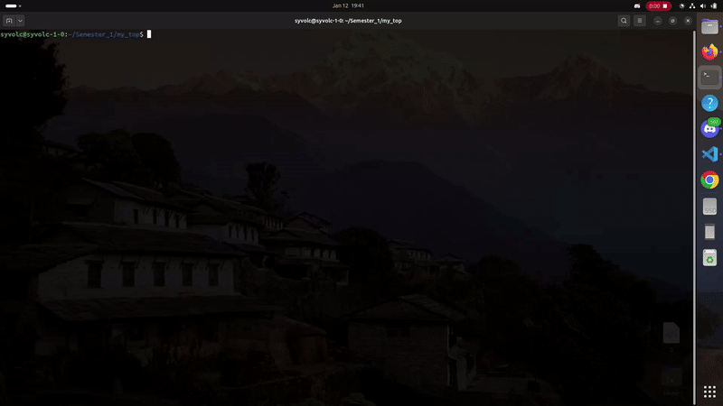
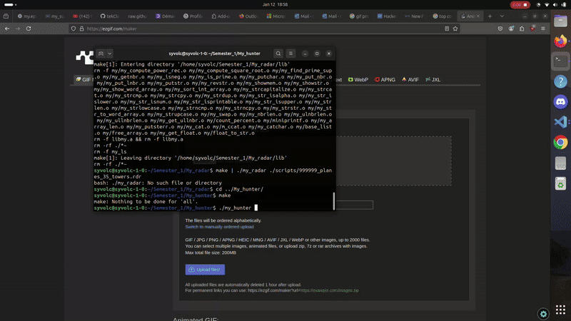
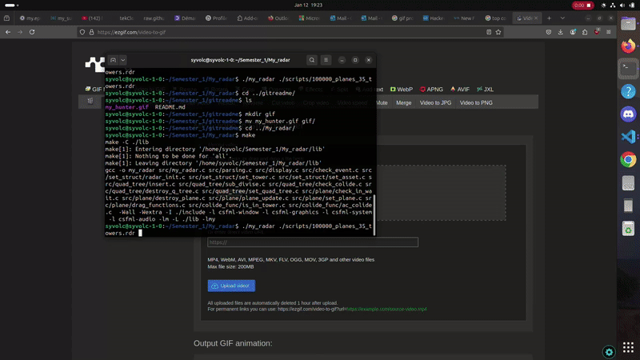

<h2 align="left">Hi 👋! My name is Clovis and i'm a freshman year student at Epitech.</h2>

###

  
  

###

  
  
  
  
  
  
  
  
  
  
  

###

  

###

<h2 align="left">Some of my first semester project:</h2>

###

